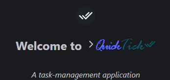
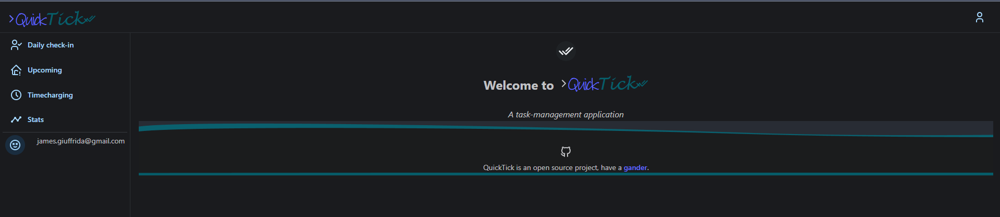

# Quick Tick

Task-management application using React and Google Tasks

Hosted at: https://jamesgiu.github.io/quick-tick/

## Commands

### `npm run dev`

Runs the app in the development mode.\
Open [http://127.0.0.1:5173](http://127.0.0.1:5173/) to view it in the browser.

The page will reload if you make edits.\
You will also see any lint errors in the console.

### `npm run deploy`

Will deploy the application to `github-pages` to be hosted.

See more: https://github.com/jamesgiu/quick-tick/deployments/activity_log?environment=github-pages

### Other
#### `npm run lint` and `npm run lint:fix`

Runs `eslint` over the project.

#### `npm run lint:css` and `npm run lint:css:fix`

Runs `stylelint` over the project.

#### `npm run style` and `npm run style:fix`

Runs `prettier` over the project.

## Contributing

Feel free to contribute to any [Issues](https://github.com/jamesgiu/quick-tick/issues) or [make your own](https://github.com/jamesgiu/quick-tick/issues/new/choose)!

The guidelines are as follows:

- There are no guidelines in the wild west.

## Host it yourself
### .env file keys
#### 1. VITE_GC_CLIENT_ID
Retrieved from https://console.cloud.google.com/apis/credentials

## Screenshots

